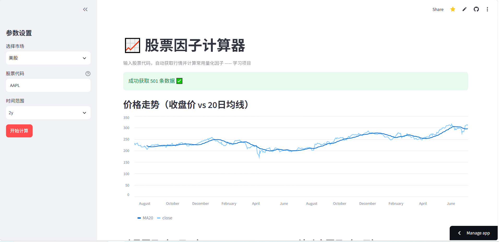

# 📈 股票因子计算器

一个基于 Streamlit 的 Web 应用：输入股票代码，自动获取行情数据并计算常用量化因子（均线、动量、波动率、RSI），支持美股和 A 股。

> 个人学习项目，用于练习 Python 数据处理与 Web 应用开发。
## 页面链接
https://stock-computer-demo.streamlit.app/
## 页面展示

## 功能特性

- 支持美股（yfinance）和 A 股（akshare）两个市场
- 计算 4 类经典因子：移动平均、动量、波动率、RSI
- 交互式图表展示价格走势与因子曲线
- 一键导出计算结果为 CSV

## 技术栈

| 用途 | 技术 |
|------|------|
| Web 界面 | Streamlit |
| 数据处理 | pandas / numpy |
| 数据源 | yfinance（美股）、akshare（A股）|

## 项目结构

```
stock/
├── app.py            # Streamlit 界面 + 程序入口
├── data.py           # 数据获取（对接不同数据源）
├── factors.py        # 因子计算（纯函数，易测试）
├── requirements.txt  # 依赖清单
└── README.md
```

设计上采用「关注点分离」：数据获取、因子计算、界面展示各司其职，互不干扰，便于维护和扩展。

## 快速开始

### 1. 创建虚拟环境（推荐）

```bash
python3 -m venv venv
source venv/bin/activate        # Windows: venv\Scripts\activate
```

### 2. 安装依赖

```bash
pip install -r requirements.txt
```

### 3. 运行应用

```bash
streamlit run app.py
```

浏览器会自动打开 `http://localhost:8501`。

### 单独测试某个模块

```bash
python data.py      # 测试数据获取
python factors.py   # 测试因子计算（不联网）
```

## 因子说明

| 因子 | 含义 | 用途 |
|------|------|------|
| MA20 | 20 日移动平均 | 判断趋势方向 |
| 动量 | 过去 20 日累计涨幅 | 衡量涨跌力度 |
| 波动率 | 日收益率标准差 | 衡量风险 |
| RSI | 相对强弱指标 (0-100) | 判断超买/超卖 |

## 后续规划（学习路线）

- [ ] 加入单元测试（pytest）
- [ ] 拆分为 FastAPI 后端 + 前端
- [ ] 因子回测（IC 值、分层收益）
- [ ] Docker 容器化部署
- [ ] 部署到 Streamlit Community Cloud
